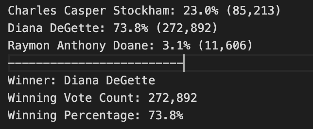

# Election_Analysis

## Election Audit Overview
A Colorado Board of Elections employee requested the following tasks be completed to conduct a election audit of the recent local congressional election.

1. Calculate the total number of votes cast.
2. Get a complete list of candidates who received votes.
3. Calculate the total number of votes each candidate received.
4. Calculate the percentage of votes each candidate won.
5. Determine the winner of the election based on popular vote.
6. Get the vote turnout for each county
7. Calculate the percentage of votes received from each county.
8. Determine the county with the highest turnout

## Resources
- Data Source: election_results.csv
- Software: Python 3.6.1, Visual Studio Code, 1.38.1

## Election Audit Results
The analysis of the election shows that:
- There were a total of **369,711** votes cast in the election.
- Breakdown of votes and percentage of total votes by county:

- According to the breakdown provided above, it show that **Denver** has the largest number of votes. Contributing **82.8%** of the total election votes Denver totaled **306,055** votes.

- The candidate results were:
 
- According to the candidate breakdown provided about, The winner of the lection was:
  - **Diana DeGette**, who received **73.8%** of the votes and **272,892** number of the votes.

## Election Audit Summary
In conclusion, I would like to present a business proposal on how this script can be modified and used for other elections. First,  weights could be assigned to the counties to represent the weights of the electoral college votes. Lastly it could include political parties and state the number of votes, the percentage weight and "winning" party on the text analysis file. 
